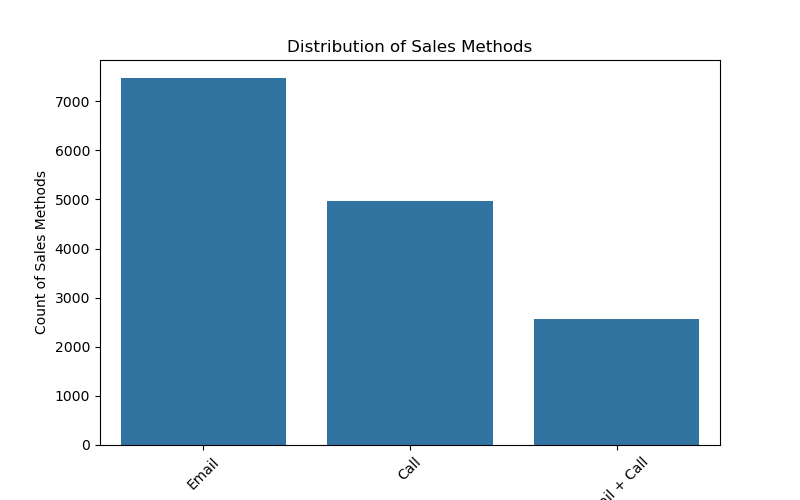
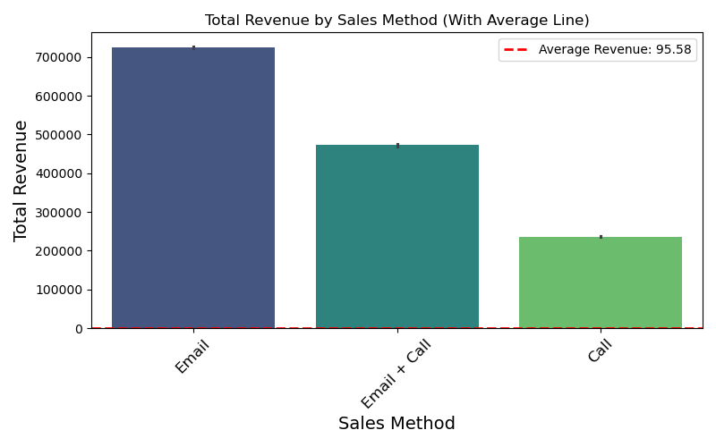
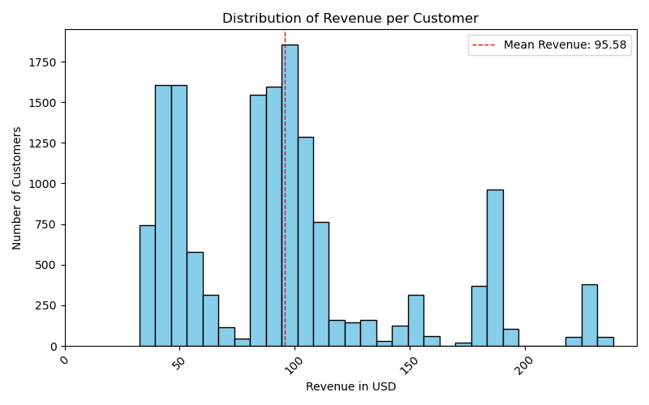
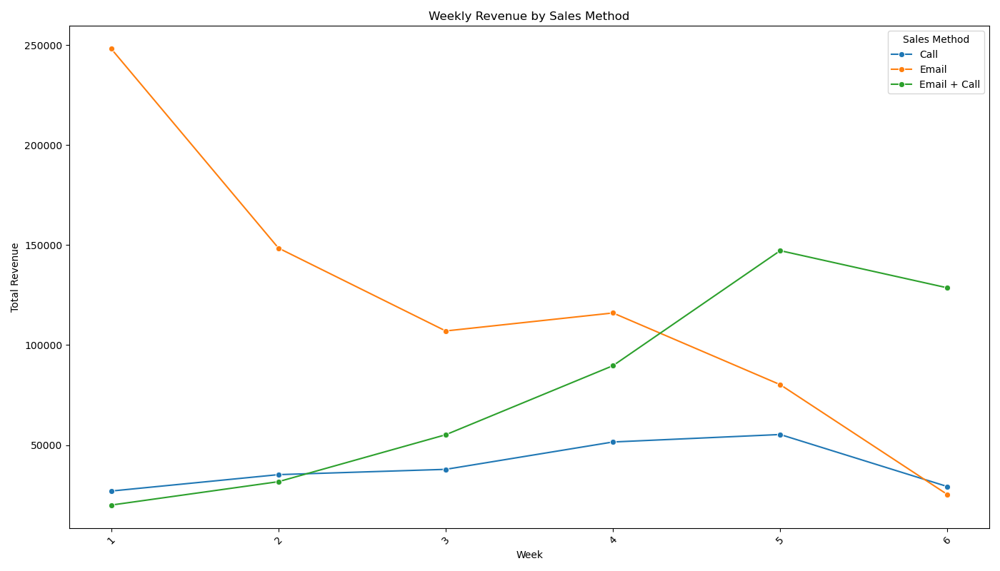
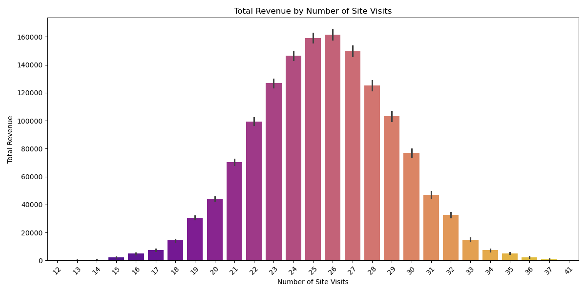
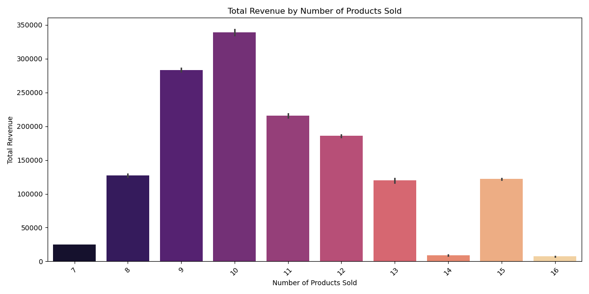
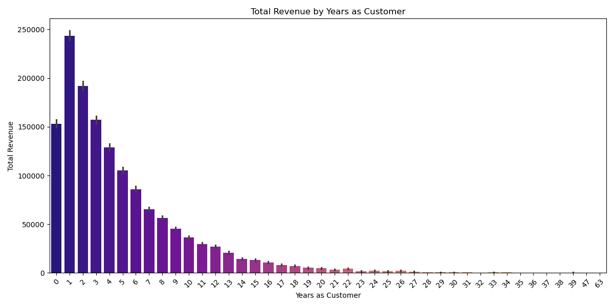
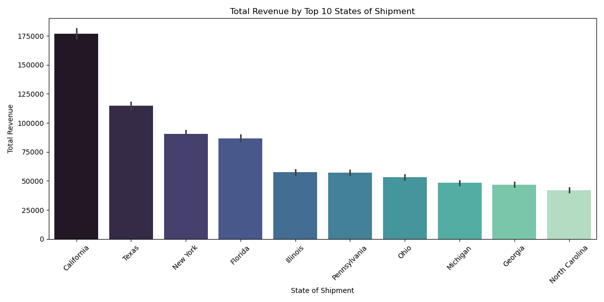
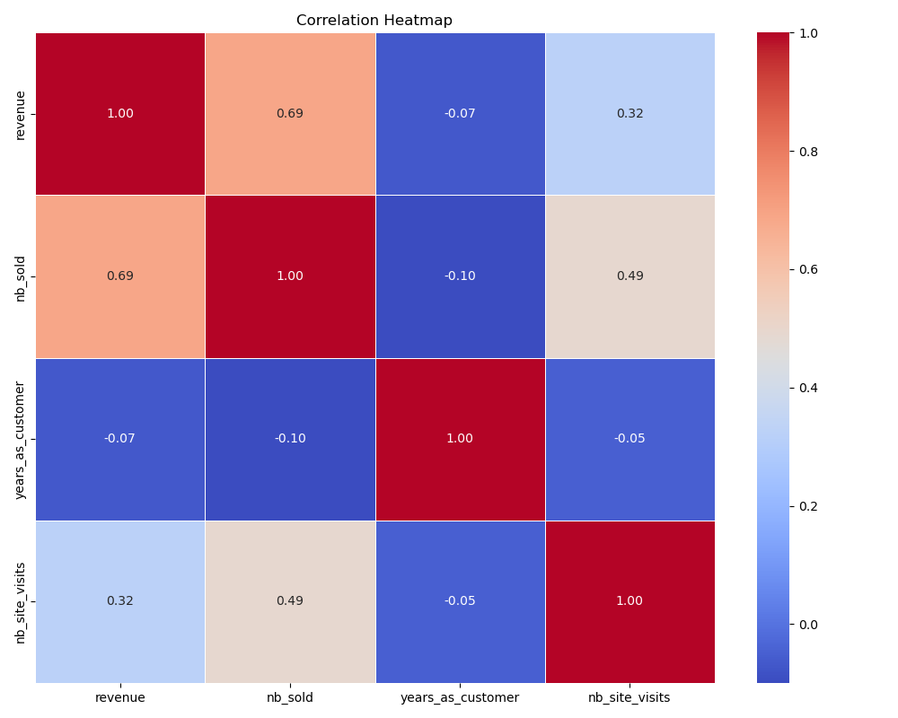

# 📊 Sales Strategy Analysis: Written Report

---

## 🔧 Data Validation

I reviewed and cleaned the dataset containing 15,000 customer records across 8 columns. Below is a detailed breakdown of the validation and cleaning steps performed for each column:

### Column-by-Column Validation

#### 1. `week`
- Confirmed all values are integers between 1 and 6 (valid campaign weeks).
- No missing values detected.

#### 2. `sales_method`
- Initially contained 5 inconsistent values (e.g., `"Em + Call"`, `"email"`).
- Standardized formatting using title case.
- Corrected `"Em + Call"` to `"Email + Call"`, resulting in 3 valid categories.

#### 3. `customer_id`
- All 15,000 entries were unique — no duplicates or missing values found.

#### 4. `nb_sold`
- Confirmed values ranged between 7 and 16, and datatype is integer.
- No missing or suspicious values.

#### 5. `revenue`
- Identified 1,074 missing values (~7.2%).
- Imputed missing values using the **mean revenue per `sales_method`**.
- Verified all values are floats, and no missing entries remain after imputation.
- Retained high-value outliers as they are plausible in B2B sales.

#### 6. `years_as_customer`
- Values ranged from 0 to 63 — valid based on company history.
- No missing or invalid values; outliers retained after review.

#### 7. `nb_site_visits`
- Values ranged from 12 to 41 — appropriate for a 6-month window.
- No missing values; distribution appears consistent.

#### 8. `state`
- 50 unique U.S. state values confirmed — no typos or null entries.
- Column is consistent and clean.

#### 9. Outliers
- Inspected using descriptive statistics and boxplots for: `revenue`, `nb_sold`, `years_as_customer`, and `nb_site_visits`.
- Outliers were kept, as they represent valid edge-case customer behavior (e.g., high purchases, legacy clients).

---

## 📊 Exploratory Analysis

To answer the sales team's questions, I explored both single-variable and multi-variable relationships using visualizations.

### 1. Single Variable Visuals

#### 📌 Customer Count per Sales Method

- Most customers received **Email**, followed by **Call**.
- **Email + Call** had the fewest customers.

#### 📌 Total Revenue per Sales Method

- **Email** generated the highest total revenue.
- Followed by **Email + Call**, then **Call**.

#### 📌 Revenue Distribution

- Most customers spent between **$50–$100**.
- Average revenue is **$95.58**.
- A few customers spent **over $200**, indicating a right-skewed distribution.

---

### 2. Multi-Variable Visuals

#### 📌 Revenue Over Time by Sales Method

- **Email** peaked in Week 1 but declined.
- **Email + Call** gradually increased, surpassing Email in Week 4.
- **Call** remained flat throughout.

#### 📌 Revenue vs Site Visits

- Revenue increased up to **26 visits**, then declined.
- Suggests an optimal engagement level between 22–28 visits.

#### 📌 Revenue vs Products Sold

- Revenue peaked at **10 items sold**.
- Higher quantities (14–16 items) didn’t always result in higher revenue.

#### 📌 Revenue vs Years as Customer

- Highest revenue came from customers with **0–3 years** of history.
- Revenue gradually decreased for longer-tenured customers.

#### 📌 Revenue by Top 10 Shipment States

- **California**, **Texas**, and **New York** had the highest revenue contributions.

#### 📌 Correlation Heatmap

- `nb_site_visits` and `nb_sold` had weak positive correlation with `revenue`.
- `years_as_customer` showed very little correlation with revenue.

---

### 3. Metric Definition: **Average Revenue per Customer (ARPC)**

To effectively monitor future campaign performance, I recommend tracking:

> **Average Revenue per Customer by Sales Method**

This metric reflects both engagement and efficiency.

#### 📊 ARPC from Current Data:

| Sales Method     | Avg Revenue per Customer |
|------------------|--------------------------|
| **Call**         | $47.60                   |
| **Email**        | $97.13                   |
| **Email + Call** | **$183.65**              |

**Conclusion:** *Email + Call* produces the highest revenue per customer and should be prioritized.

---

## ✅ Final Summary & Recommendations

### Summary:
- **Email + Call** is the most effective method over time.
- **Email-only** is efficient and scalable.
- **Call-only** is high-effort with low return.

### Recommendations:
1. **Prioritize Email + Call** — it strikes the best balance between effort and return.
2. **Use Email-only** for broad outreach with minimal resource usage.
3. **Phase out Call-only** — it’s resource-intensive with poor performance.
4. **Track ARPC weekly** for each sales method to guide decisions.
5. **Target new customers (0–3 years)** and those with **moderate site visits (22–28)** for better returns.

---

